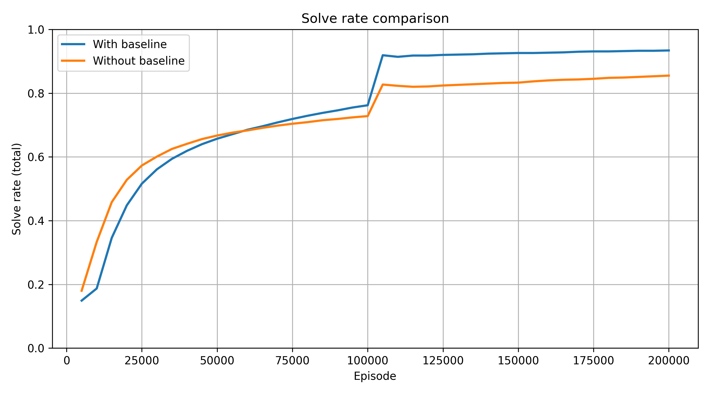
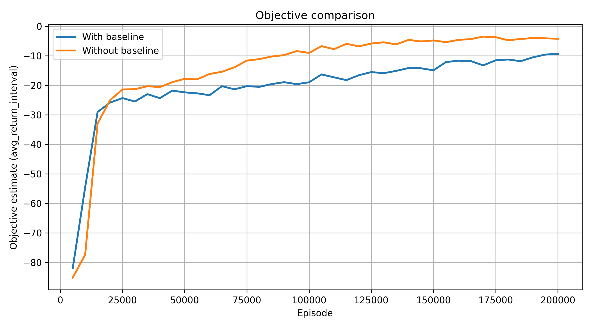
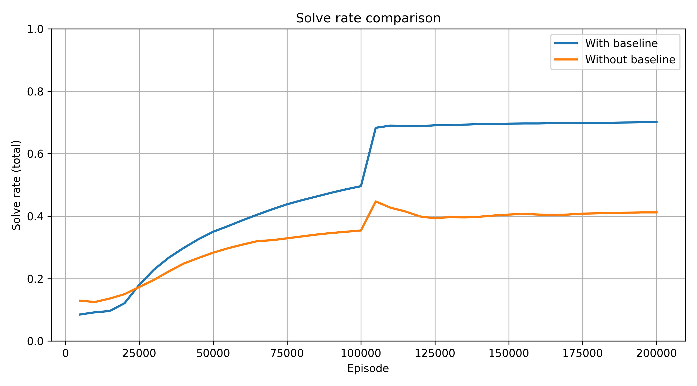
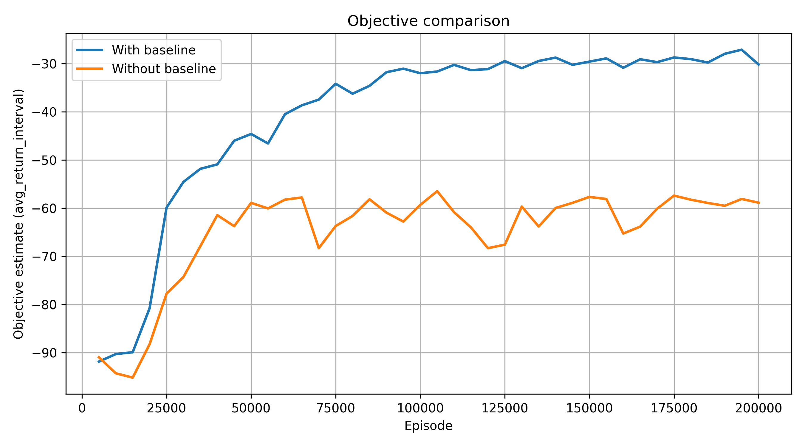

# Cube-Reinforcer. Baseline in REINFORCE

## Motivation

Policy objective (definition):
```math
J(\theta) = \mathbb{E}_{\pi^\theta}\left[\sum_{t=0}^{T-1} \gamma^t r(S_t, A_t)\right],
```
where $\gamma \in \left[0,1\right]$ is the discount factor.
Gradient estimator:
```math
\nabla_\theta J(\theta)
=
\mathbb{E}_{\pi^\theta}
\left[
\sum_{t=0}^{T-1}
\gamma^t R_t \nabla_\theta \log \pi^\theta (A_t \mid S_t)
\right]
```
where
```math
R_t = \sum_{k=t}^{T-1} \gamma^{k-t} r(S_k, A_k).
```

The idea is to perform gradient ascent
```math
\theta \longleftarrow \theta + \alpha \cdot \nabla_\theta J(\theta)
```

Although the gradient estimator is unbiased, it suffers from high variance, which may lead to unstable training.
To reduce variance, we introduce a baseline.

## Baseline Idea

Instead of directly using the return $R_t$, we compute an advantage:

```math
R_t - b_t,
```

where $b_t$ is a baseline independent of the action.

The modified gradient becomes:

```math
\nabla_\theta J(\theta)
=
\mathbb{E}_{\pi^\theta}
\left[
\sum_{t=0}^{T-1}
\gamma^t (R_t - b_t) \nabla_\theta \log \pi^\theta (A_t \mid S_t)
\right]
```

Since the baseline does not depend on the action:

```math
\mathbb{E}\left[
b_t \nabla_\theta \log \pi_\theta(a_t \mid s_t)
\right]
=
0,
```

the estimator remains unbiased.

---

## Our Baseline Implementation

We use a batch mean return baseline.

Given a batch of N sampled trajectories, we compute the baseline as the
mean return across the batch:

```math
b_t = \frac{1}{N} \sum_{i=1}^{N} R_t^{(i)}.
```
## Training Results
During training, we evaluate the cumulative solve rate defined as
```math
\text{solve\_rate}_{\text{total}}
=
\frac{
\text{number of solved episodes}
}{
\text{total number of episodes}
}
```

| Parameter | Value |
|---|---:|
| Batch size | 16 |
| Max episode steps | 15 |
| Discount factor $\gamma$ | 0.99 |
| Learning rate $\alpha$ | 0.001 |

---

### Training to solve 2 scramble steps

<p align="center">
  
  <br>
  <em>Figure 1: Solve-rate comparison with vs. without baseline (2 scramble steps).</em>
</p>

<p align="center">
  
  <br/>
  <em>Figure 2: Objective (avg_return_interval) comparison with vs. without baseline (2 scramble steps).</em>
</p>

---

### Training to solve 4 scramble steps

<p align="center">
  
  <br>
  <em>Figure 2: Solve-rate comparison with vs. without baseline (4 scramble steps).</em>
</p>

<p align="center">
  
  <br/>
  <em>Figure 3: Objective (avg_return_interval) comparison with vs. without baseline (4 scramble steps).</em>
</p>

We can see that baseline improves final performance. As task difficulty increases, variance reduction becomes more important. Therefore, for the 4 scramble task the difference between the solve rate curves is more noticeable than for the 2 scramble task. 

The objective curves corresponding to the baseline variant are smoother and have fewer oscillations. This is consistent with the theoretical role of the baseline in reducing gradient variance.

