# 🧊 Cube-Reinforcer

> **Cube-Reinforcer** is a research-style project about solving the **2x2 Rubik’s Cube** with a custom simulator and a PyTorch REINFORCE pipeline.

The repository combines:
- a mathematically correct 2x2 cube engine with 12 discrete actions,
- a GUI + HTTP simulator API for control and visualization,
- a policy-gradient training stack for RL experiments.

📌 **Installation, commands, and run instructions:** see [RUNME.md](RUNME.md).

---

## 📑 Table of Contents
1. [Project Overview](#project-overview)
2. [Why This Problem Is Hard](#why-this-problem-is-hard)
3. [2x2 Rubik Cube Facts](#2x2-rubik-cube-facts)
4. [Simulator](#simulator)
5. [Training (REINFORCE, PyTorch)](#training-reinforce-pytorch)
6. [Experiments](#experiments)
7. [Current Limits and Notes](#current-limits-and-notes)

---

## 🧩 Project Overview
The project is focused on RL for a compact but non-trivial combinatorial domain:
- **Environment**: true 2x2 Rubik cube dynamics.
- **Action space**: 12 actions (`U/D/L/R/F/B` with `+/-` quarter-turns).
- **State**: one-hot stickers (`24 x 6`), with additional one-hot history of the last 4 actions.
- **Policy**: two-layer neural network implemented in PyTorch.
- **Algorithm**: REINFORCE with discounted returns (no learned value network).

**Main goals:**
- Produce a deterministic, testable simulator.
- Provide online control via HTTP for RL loops.
- Train and evaluate policies with checkpoint resume.

---

## 💪 Why This Problem Is Hard
Even for a 2x2 cube, the task is difficult for RL because:
- transitions are deterministic but highly non-linear in sticker space,
- rewards are sparse if only solved/not solved is used,
- local action effects are deceptive (easy to undo progress),
- representation and exploration strategy strongly affect sample efficiency.

From an engineering perspective, complexity comes from:
- exact move permutations,
- orientation-invariant solved checks,
- synchronized GUI + HTTP + animation,
- Stable training with parallel environments and custom gradients.

---

## 📐 2×2 Rubik Cube Facts
- The 2×2 cube (Pocket Cube) has **3,674,160 reachable states**.
- Every state is solvable in at most **11 face turns** in the standard optimal metric for 2×2.
- Unlike 3×3, 2×2 has only corner cubies (no fixed centers/edges), but orientation/permutation constraints still make the space highly structured.

---

## 🎮 Simulator


### 🎯 Purpose
The simulator provides:
- exact 2x2 dynamics for RL,
- one-hot state API for agents,
- GUI for interactive inspection and animated evaluation.

### ⚙️ Full Functionality
- True 2x2 cube transitions via precomputed sticker permutations.
- `cube_size` hyperparameter exposed in CLI (`v1` supports only `2`).
- Scramble with optional seed.
- Scramble logic excludes immediate inverse of the previous scramble action.
- Orientation-invariant solved check.
- Headless HTTP server mode.
- GUI mode with:
  - 3D-style rendering,
  - mouse camera rotation,
  - face rotation animation,
  - `Scramble`, `Reset`, `Eval ON/OFF`,
  - `Anti-repeat x5` checkbox in eval mode.

### ⌨️ GUI Controls
- Mouse drag: rotate camera.
- Keyboard turns:
  - `U/J` -> `U+/U-`
  - `D/C` -> `D+/D-`
  - `L/K` -> `L+/L-`
  - `R/E` -> `R+/R-`
  - `F/G` -> `F+/F-`
  - `B/N` -> `B+/B-`
- `ESC` or `Q`: quit.

### 📊 State and Observation Format
- API state format: one-hot matrix `shape = (24, 6)`.
- Internally, color IDs are also supported as flat length-24 vectors.
- RL observation:
  - cube one-hot: `24 * 6 = 144`,
  - action history one-hot (last 4 actions): `4 * 12 = 48`,
  - total input size: `192`.

### 📋 Action Index Table
| Action | Meaning |
|---|---|
| 0 | U+ |
| 1 | U- |
| 2 | D+ |
| 3 | D- |
| 4 | L+ |
| 5 | L- |
| 6 | R+ |
| 7 | R- |
| 8 | F+ |
| 9 | F- |
| 10 | B+ |
| 11 | B- |

---

## 📐 Training (REINFORCE, PyTorch)

### 📉 Algorithm and Notation
Notation follows standard REINFORCE lecture style. Random variables are denoted by capital letters, data points by lowercase letters.
- $\mathbb{S}$ — state space, $s \in \mathbb{S}$ — state; $\mathbb{A}$ — action space, $a \in \mathbb{A}$ — action.
- Environment: $S_{t+1} \sim p(\cdot\mid S_t, A_t)$
- Policy: $A_t \sim \pi^{\theta}(\cdot\mid S_t)$
- Reward: $R_t \sim p^{R}(\cdot\mid S_t, A_t)$
- Trajectory: $z_{0:T} = \{(s_0,a_0), (s_1,a_1), \dots, (s_{T-1},a_{T-1})\}$, where $T$ is the length of the episode

Policy objective (definition):
```math
J(\theta) = \mathbb{E}_{\pi^\theta}\left[\sum_{t=0}^{T-1} \gamma^t r(S_t, A_t)\right],
```
where $\gamma \in \left[0,1\right]$ is the discount factor.

Gradient estimator:
```math
\nabla_\theta J(\theta)
=
\mathbb{E}_{\pi^\theta}
\left[
\sum_{t=0}^{T-1}
\gamma^t R_t \nabla_\theta \log \pi^\theta (A_t \mid S_t)
\right]
```
where
```math
R_t = \sum_{k=t}^{T-1} \gamma^{k-t} r(S_k, A_k).
```

The idea is to perform gradient ascent
```math
\theta \longleftarrow \theta + \alpha \cdot \nabla_\theta J(\theta)
```

### 🧠 Network representing policy $\pi^\theta$
Current policy in code:
- input $x\in\mathbb{R}^{192}$,
- first affine layer:

```math
h^{(1)}_{\text{pre}} = xW_1 + b_1,\quad W_1\in\mathbb{R}^{192\times 512}
```

- first activation:

```math
h^{(1)} = \text{ELU}(h^{(1)}_{\text{pre}})
```

- second affine layer:

```math
h^{(2)}_{\text{pre}} = h^{(1)}W_2 + b_2,\quad W_2\in\mathbb{R}^{512\times 128}
```

- second activation:

```math
h^{(2)} = \text{ELU}(h^{(2)}_{\text{pre}})
```

- output affine layer:

```math
z = h^{(2)}W_3 + b_3,\quad W_3\in\mathbb{R}^{128\times 12}
```

- action probabilities:

```math
\pi = \text{softmax}(z)
```

### ✏️ Gradient $\nabla_\theta \log \pi^\theta$
Policy as a vector:
```math
\pi^\theta(\cdot\mid s) = \pi =
\begin{pmatrix}
\pi_{1} \\ \pi_2 \\ \vdots \\ \pi_{12}
\end{pmatrix},
```
where by $\pi_a$ we denote the probability $\pi^\theta(a\mid s)$ of taking action $a \in \mathbb{A}$ in state $s \in \mathbb{S}$.

Log-probability (softmax):
```math
\log(\pi^\theta(a\mid s)) = \log(\pi_a) = \log\left(\frac{e^{z_a}}{\sum_{j}e^{z_j}}\right) = z_a - \log\left(\sum_{j}e^{z_j}\right).
```

Derivative w.r.t. logits:
```math
\frac{\partial}{\partial z_i} \log(\pi^\theta(a\mid s)) =
\begin{cases}
1 - \pi_i, & i = a, \\
-\pi_i, & i \neq a.
\end{cases}
```

Gradient vector:
```math
\frac{\partial \log \pi_\theta(a\mid s)}{\partial z} =
\begin{pmatrix}
\frac{\partial \log \pi_\theta(a\mid s)}{\partial z_1} \\ \vdots \\ \frac{\partial \log \pi_\theta(a\mid s)}{\partial z_{12}}
\end{pmatrix}
= e_a - \pi,
```
where $e_a$ is the 12-dimensional one-hot vector for action $a \in \mathbb{A}$. Set $\delta = e_a - \pi$. Then the gradient w.r.t. the output layer is:
```math
\boxed{
\frac{\partial \log \pi}{\partial W_2} = h^\top \delta,\qquad
\frac{\partial \log \pi}{\partial b_2} = \delta
}
```

By the chain rule, gradients w.r.t. $W_1$ and $b_1$:
```math
g_h = W_2\delta,\qquad
g_{\text{pre}} = g_h \odot \text{ELU}'(h_{\text{pre}}),
```
```math
\boxed{
\frac{\partial \log \pi}{\partial W_1} = x^\top g_{\text{pre}},\qquad
\frac{\partial \log \pi}{\partial b_1} = g_{\text{pre}}
}
```

### 💪 Optimization
Training uses standard PyTorch autograd with Adam optimizer:

```math
\mathcal{L}(\theta) = -\frac{1}{B}\sum_{i=1}^{B}\sum_t G_t^{(i)}\log \pi_\theta(a_t^{(i)}\mid s_t^{(i)})
```

where \(B = \texttt{--num-envs}\) is the number of episodes collected per update step.

Batch update (average over parallel environments):
```math
\Delta\theta = \frac{1}{B}\sum_{i=1}^{B}\sum_t G_t^{(i)}\nabla_\theta \log \pi_\theta(a_t^{(i)}\mid s_t^{(i)})
```

### 🏆 Reward Shaping
Default reward components:
- step reward: `-1`,
- inverse-to-previous-action penalty: `-20`,
- 4 identical actions in a row penalty: `-100`,
- timeout (unsolved at max steps): additional `-100`.

**Scramble curriculum:** each episode uses a **fixed** scramble depth equal to current curriculum level; starts from the configured initial value; when batch solve-rate `SR > 0.8`, curriculum increases by `+1`; maximum curriculum level is `10`.

**Batch-size / learning-rate:** gradients are **averaged** across parallel environments, not summed:
```math
g_{\text{batch}}=\frac{1}{B}\sum_{i=1}^{B} g_i,\qquad
\theta \leftarrow \theta + \text{lr}\cdot g_{\text{batch}}
```
so the update scale is stable when `--num-envs` changes.

---

## 📊 Experiments
Evaluation was run on a single trained checkpoint against 100 randomly scrambled episodes per depth, sweeping scramble depths from 1 to 50.  
Two step budgets are compared: **25 steps** and **100 steps** per episode.

### 📈 Steps-to-Solve
Steps-to-solve statistics are split into two groups:
- **Solid lines** — statistics computed only over episodes the agent actually solved (`Solved min / mean / max`).
- **Dashed lines** — statistics computed over all episodes including timeouts (`All min / mean / max`).

**100-step budget**

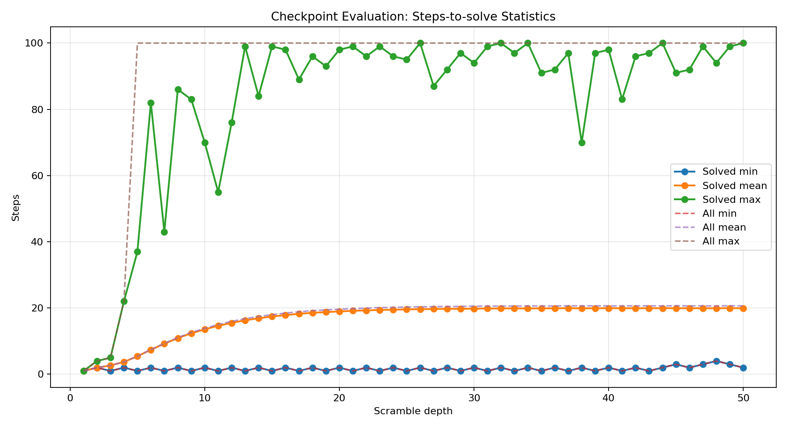

With a 100-step budget the agent reliably solves even deeply scrambled cubes.
The `Solved mean` rises from ~2 steps at depth 1 to ~23 steps and then plateaus for depths above ~10 — meaning the policy finds a consistent solution path whose length is bounded regardless of how scrambled the initial state is (since the cube state distribution saturates quickly with depth).
`Solved max` hits the 100-step ceiling starting at depth ~5–6: occasionally the agent needs almost the full budget for harder positions.
`All mean` tracks slightly above `Solved mean` (~27 steps at plateau) because a small fraction of episodes time out, pulling the average up.

**25-step budget**

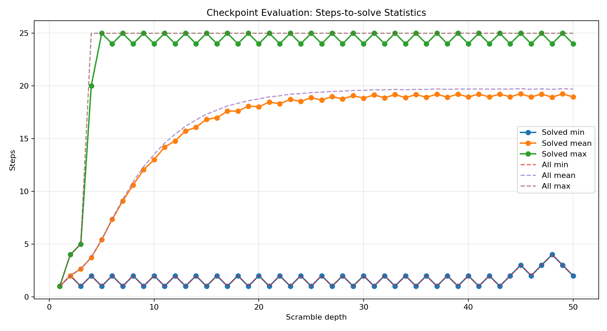

With a 25-step budget the same qualitative shape appears but is compressed.
`Solved max` hits the 25-step ceiling earlier (depth ~3–4), and `All mean` diverges visibly from `Solved mean` at moderate depths — reflecting the higher timeout rate when the budget is tight.

### ✅ Success Rate
Success rate is the fraction of episodes (out of 100) the agent solved within the allowed step budget.

**100-step budget**


With 100 steps the agent achieves near-perfect success rate (~0.99) at low scramble depth and degrades only gently to ~0.95 at depth 50.
The policy generalises well: 100 steps is a sufficient budget for almost any reachable 2×2 state, and the slight decline at higher depths is due to a small number of positions that require long solution paths.

**25-step budget**

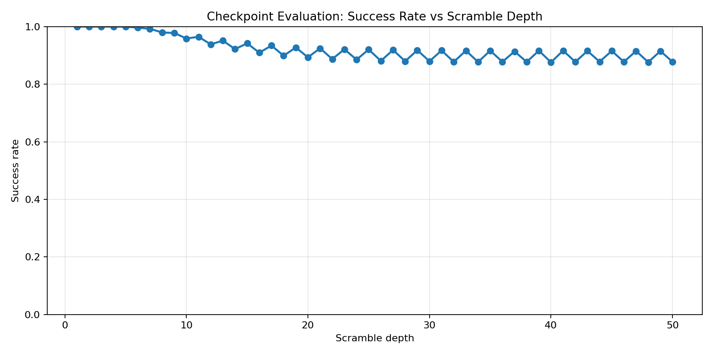

With only 25 steps the success rate starts at ~1.0 for shallow scrambles, drops steeply through depths 5–20, and then plateaus at ~0.60–0.65 for depths above ~25.
The drop reflects the step budget becoming the bottleneck rather than policy quality: the agent knows how to solve the cube but cannot complete the solution within 25 moves for harder scrambles.
The sawtooth oscillation visible in the plateau region is a parity effect — even and odd scramble depths produce structurally different position distributions (e.g. an even-depth scramble can be undone in an even number of moves), causing alternating slight changes in difficulty.

---

### 📉 Training Curves
A logarithmic scale is used for the number of episodes for better readability.

**🎯Success rate vs scramble depth**

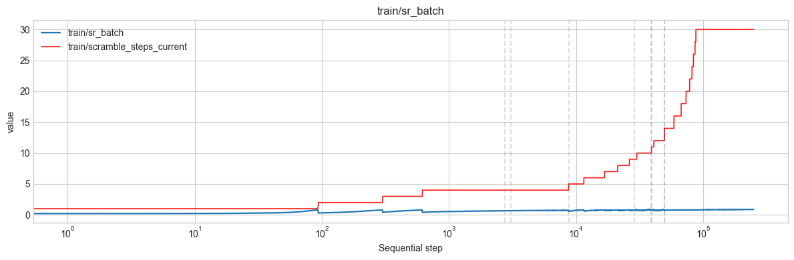

We used curriculum learning: when the batch solve rate reaches 80%, training advances to the next stage with more scrambles. The plot shows how success rate evolves with scramble depth over training. At around 30 scrambles the cube state distribution is effectively saturated (fully chaotic), and success rate stabilises.

**🪃Returns per scramble depth**

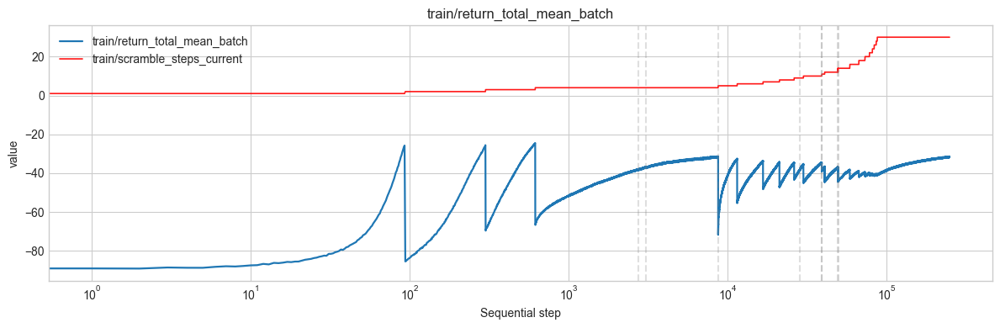

Mean return per scramble depth. It converges to a single value after approximately 20 scrambles.

**🎲Mean return per batch**

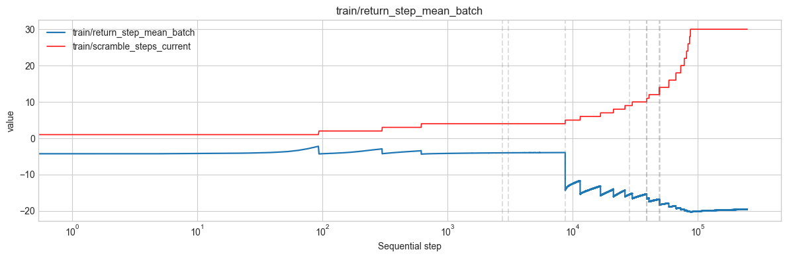

*Batch* here is the number of parallel environments (envs) per update.

**🎰Returns: timeouts and inverse actions**

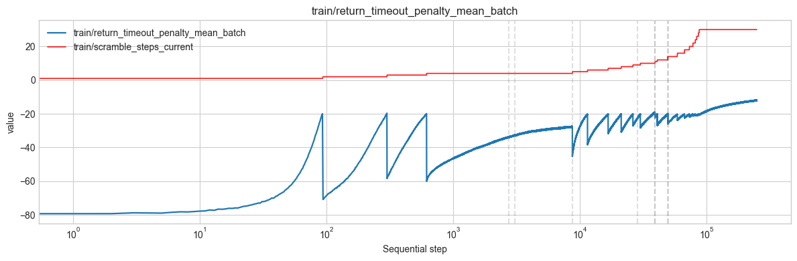
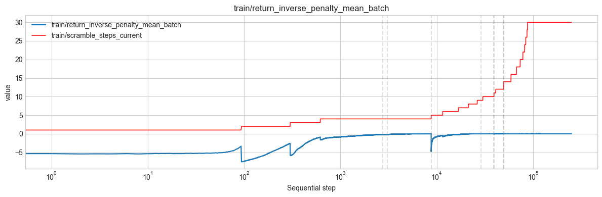

Returns for unfinished episodes (timeouts) and for symmetrical action patterns (e.g. [+1, −1, +1, −1…] — inverse moves).

**🥇Total reward**

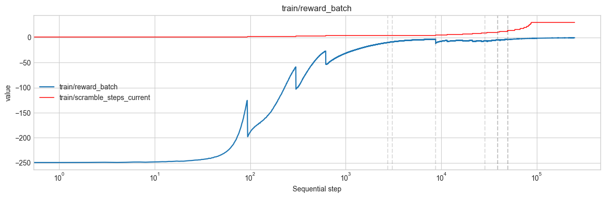

Total reward likewise converges to its maximum.

**🚶‍➡️🚶‍➡️🤦Steps per episode**

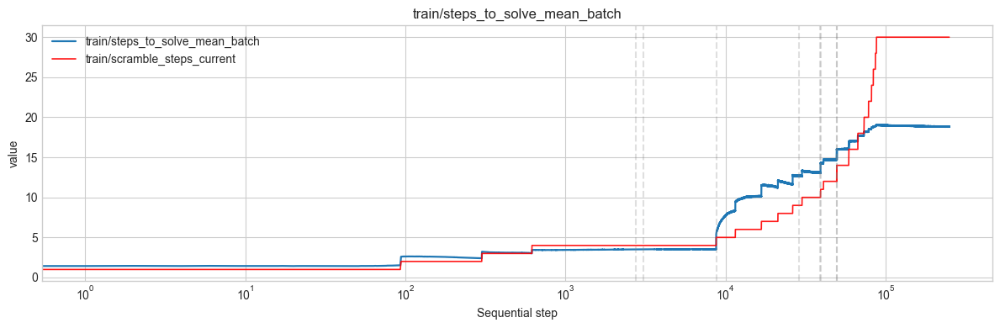

Steps per episode to solve the cube. The God's number for 2×2 is 14; our policy typically solves in fewer than 20 steps, so it is close to optimal.

---
**🎼 GAMMA experiments**

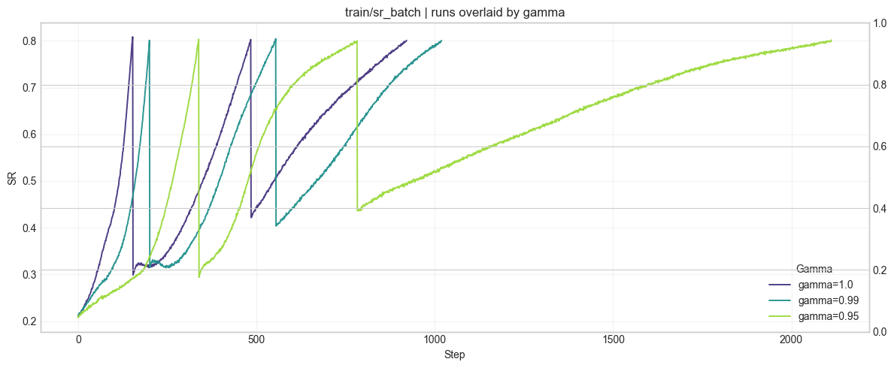

We observed that **$\gamma < 1$** makes training take much longer. In the trainer, returns are computed as discounted sums $G_t = r_t + \gamma G_{t+1}$ (see `rubik_rl/trainer.py`, default `--gamma 1.0`). With $\gamma < 1$, future rewards are downweighted, so the gradient signal for actions that lead to solving many steps later is weaker and credit assignment over the full trajectory is harder. For this finite-horizon task we use **$\gamma = 1$** (undiscounted total reward) so the solve event is fully credited and learning converges faster.

## 🕋 🤫 ##
A **3×3** version is in development: [Cube-Reinforcer 3×3 branch](https://github.com/VladSarm/Cube-Reinforcer/tree/3x3).
